<p align="center">
    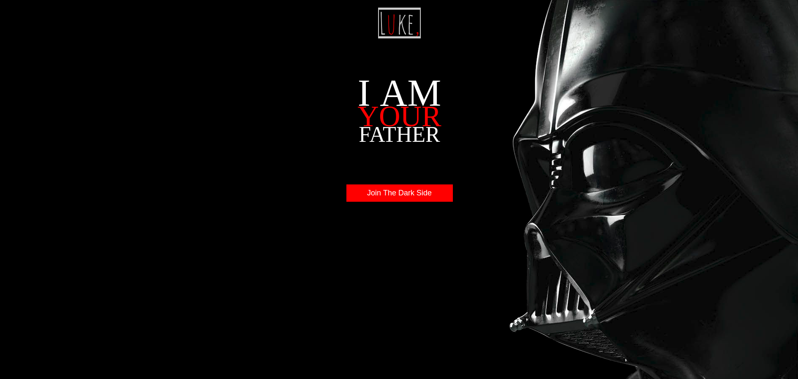
</p>

# Star War Maze Game

By utilising HTML5, CSS3 and jQuery I designed and built a stylised, collision-based JavaScript game named "". This is a maze game based on star war plot of the story between Luke and his father Darth Vadar.

### Win Logic

The win logic consists of two stages of objectives:

- Finding the light saber
- Choose between:
	- join the dark side
	- eliminate the dark side by killing Darth Vadar

Basically, this has been achieved by defining 3 variables originally:

```js
var swordOrNot = false;
var joinDarkOrNot = false;
var murderFatherOrNot = false;
```
Either second or third can only be achieved on the premise that the first one has been achieved.


### Game Layout

The maze has been defined by arrays of strings:

- `'a'` for available spaces where Luke is free to move;
- `'s'` for the light saber sword;
- `'g'` for the goal which is the Darth Vadar
- `'w'` for wall where Luke cannot push;
- `'b'` for boxes which Luke:
	- is able to push when the unit behind the box is available space;
	- is unable to push when the unit behind is either wall, another box, sword or goal;

```js
// Build up game maze, w for wall, a for available, g for goal
var row0 = [ 'w', 'w', 'w', 'w', 'w', 'w', 'w', 'w', 'w', 'w', 'w', 'w', 'w', 'w', 'w', 'w', 'w', 'w'];
var row1 = [ 'w', 'a', 'a', 'a', 'a', 'a', 'a', 'a', 'a', 'a', 'a', 'a', 'a', 'a', 'a', 'a', 'a', 'w'];
var row2 = [ 'w', 'a', 'w', 'a', 'w', 'a', 'w', 'a', 'b', 'b', 'b', 'a', 'a', 'w', 'w', 'w', 'a', 'w'];
var row3 = [ 'w', 'a', 'w', 'a', 'w', 'a', 'w', 'a', 'b', 'a', 'a', 'b', 'a', 'a', 'w', 'a', 'a', 'w'];
var row4 = [ 'w', 'a', 'w', 'a', 'w', 'a', 'w', 'a', 'b', 'a', 'a', 'b', 'a', 'a', 'w', 'a', 'a', 'w'];
var row5 = [ 'w', 'a', 'w', 'a', 'w', 'a', 'w', 'a', 'b', 'a', 'a', 'b', 'a', 'a', 'w', 'a', 'a', 'w'];
var row6 = [ 'w', 'a', 'w', 'a', 'w', 'a', 'w', 'a', 'b', 'a', 's', 'b', 'a', 'a', 'w', 'a', 'a', 'w'];
var row7 = [ 'w', 'a', 'a', 'w', 'a', 'w', 'a', 'a', 'b', 'b', 'b', 'a', 'a', 'w', 'w', 'w', 'a', 'w'];
var row8 = [ 'w', 'a', 'a', 'a', 'a', 'a', 'a', 'a', 'a', 'a', 'a', 'a', 'a', 'a', 'a', 'a', 'g', 'w'];
var row9 = [ 'w', 'w', 'w', 'w', 'w', 'w', 'w', 'w', 'w', 'w', 'w', 'w', 'w', 'w', 'w', 'w', 'w', 'w'];

var board = [row0, row1, row2, row3, row4, row5, row6, row7, row8, row9];
```
Then, the maze array has appended to the HTML by render each single string of `'w'`, `'s'` and `'g'` as an `<li>` element:

```js
function createBoard() {
    // for every item inside the board, create an <li> and append it to the ul inside the html
    for (var i = 0; i < board.length; i++) {
        for (var j = 0; j < board[i].length; j++) {
            $(`<li class="${board[i][j]}"></li>`).appendTo($('.board'));
        }
    }
}
```
Place the character of Luke onto the board:

```js
function dropCharacter() {
    $('li:nth-child(20)').addClass('luke'); // nth-child(n) n must be a number
}
```
The game has been initialised with the two functions above:

<p align="center">
    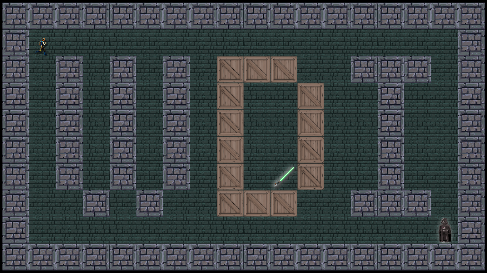
</p>

```js
// waiting for the dom to be loaded then running the init function
window.addEventListener('DOMContentLoaded', $(init));

function init() {
    createBoard();
    dropCharacter();
}
```
> The initialise block has to be placed above the two functions creating the board.

### Legal Moves

As mentioned above The maze consists of available spaces wall is where Luke cannot push and box is a unit that can be pushed when the unit behind the box is available space and unable to be pushed when the unit behind is either wall or another box.

This legal move logic has been achieved using conditional control flows statements. 

Using moving up when the block unit next in the moving direction is nether wall nor box as an example: 

```js
$(document).keydown(function(e){ // 'e' for event
    if((e.which === 38) // up arrow
        // the block next in the moving direction is nether wall nor box
        && ($($('li')[currentLukeIndex() - row0.length]).attr('class') !== 'w')
        && ($($('li')[currentLukeIndex() - row0.length]).attr('class') !== 'b')) {
        moveUpNext();
        pickSword();
    } ...
```
> `38` is the number representing the up arrow.

> `moveUpNext()` and `pickSword()` are posture functions that will be discussed later

Using pushing up when the block unit next in the moving direction is a box and the second block next after is neither a wall, box, sword nor goal as an example:

```js
 ...} else if ((e.which === 38) // up arrow
        // the block next in the moving direction is a box
        && ($($('li')[currentLukeIndex() - row0.length]).attr('class') !== 'w')
        && ($($('li')[currentLukeIndex() - row0.length]).attr('class') === 'b')
        // the second block next after can neither be wall, box, sword nor goal
        && ($($('li')[currentLukeIndex() - (row0.length * 2)]).attr('class') !== 'w')
        && ($($('li')[currentLukeIndex() - (row0.length * 2)]).attr('class') !== 'b')
        && ($($('li')[currentLukeIndex() - (row0.length * 2)]).attr('class') !== 's')
        && ($($('li')[currentLukeIndex() - (row0.length * 2)]).attr('class') !== 'g')) {
        pushUpNext();
        pickSword();
    } else if ...
```
> `row0` is the one of the arrays defining the maze shown above, `$('li')[currentLukeIndex() - row0.length]` basically represents the `<li>` element right above and `$('li')[currentLukeIndex() - (row0.length * 2)]` represents the `<li>` element 2 blocks above. 

Lastly, since the situation of two boxes lining or wall behind box hasn't been defined among the legal moves, the action simply cannot happen when the player press the corresponded key of movements in a certain direction.

### Defining Luke Position & Postures

There are 9 plausible Luke postures 

- Moving towards four directions without having the sword (`(swordOrNot === false)`):
	- `'lukeLeft'`
	- `'lukeRight'`
	- `'lukeUp'`
	- `'lukeDown'`
- Sword taken (`(swordOrNot === true)`):
	- `'lukeLeftSword'`
	- `'lukeRightSword'`
	- `'lukeUpSword'`
	- `'lukeDownSword'`
- Luke attempt to kill (only possible when sword taken): `'lukeKill'`.

In order to put the postures on the right position, we need locate the current position of Luke. This has been achieved by setting the current `<li>` that possesses class `'luke'` as 
the reference: 

```js
// reference to get current Luke position
function currentLukeIndex() {
    // always use .luke as the position reference
    const currentLiIndex = $('li').index($('li.luke'));
    return currentLiIndex;
}
```
Other than locating the position of class `'luke'`, appending the posture consists of another two actions: 

- Extract and remove the current class overlapped on the original `<li>`
- Append the right posture onto the next `<li>` in attended directions

**Function that extract the current classes:**

```js
// defining function extracting the original li element's class
function extractOriginalLiClass() {
    const originalLiClass = $($('li')[currentLukeIndex()]).attr('class');

    // extract the real action without removing position references: 'a' & 'luke'
    var txtArr = originalLiClass.split(' ');
    console.log(txtArr);

    var txtLength = txtArr.length;
    var extractTxt = [];

    for (var i = 0; i < txtLength; i++) {
        console.log(txtArr[i]);

        // append all strings that are longer than both 'a' & 'luke',
        // which is the original move we tend to eliminate into extractTxt
        txtArr[i].split('');
        var itemLength = txtArr[i].length;
        console.log(itemLength);

        if (itemLength > 4) {
            extractTxt.push(txtArr[i])
        }
    }
    console.log(extractTxt);
    return extractTxt
}
```
> It has to be cautious here not to delete `'a'` & `'luke'` in the action of extracting, or otherwise the program will lose position reference and bugs take place. Thus using `if (itemLength > 4)` as the condition to only extract the wanted class out of the array of for instance: `['a', 'luke', 'lukeLeft']`.

**Function removing them:**

```js
// removing the original li element's class
function removePreviousClass() {
    var originalLiClass = extractOriginalLiClass();

    // remove other residual effects from all previous possible actions without removing references 'a luke'
    for (var i = 0; i < originalLiClass.length; i++) {
        $('li').removeClass(originalLiClass[i]);
    }
}
```
Functions appending posture to the next `<li>` consist of three plausible situations of moving into avaible spaces, pushing boxes and picking up sword:

**Function moving into available spaces** (using moving left as an example):

```js
function moveLeftNext() {
    const newLiLeft = $('li')[currentLukeIndex() - 1];

    // indicates whether the next move to the left is feasible or not
    const newLiLeftClass = $($('li')[currentLukeIndex() - 1]).attr('class');
    console.log(newLiLeftClass);

    removePreviousClass();

    // use .luke as position reference and add real actions by overlapping onto top
    $('li.luke').removeClass('luke');
    $(newLiLeft).addClass('luke');

    // adding the class we tend to add into the next left li element
    if (swordOrNot === false) {
        // adding real direction actions before sword by overlapping onto top of .luke
        $(newLiLeft).addClass('lukeLeft');
    } else {
        // adding real direction actions after sword by overlapping onto top of .luke
        $(newLiLeft).addClass('lukeLeftSword');
    }
}
```
**Function push box** (using pushing box to left as an example): the function of pushing boxes can be divided into several steps:

- Locate and define the unit block next to Luke in the direction he is going move towards (which is currently the unit block containing the box)
- Define the second unit block behind that (which the box will be moved onto)
- Append Luke's posture onto new li element according to the position reference
- Remove the original box and add available space onto it
- Remove the available space in the second block behind the position of original box and add new box onto it.

```js
function pushLeftNext() {
    const newLiLeft= $('li')[currentLukeIndex() - 1];
    const newLiLeftBefore = $('li')[currentLukeIndex() - 2];

    removePreviousClass();

    // use .luke as position reference and add real actions by overlapping onto top
    $('li.luke').removeClass('luke');
    $(newLiLeft).addClass('luke');

    if (swordOrNot === false) {
        // adding real direction actions before having sword by overlapping onto top of .luke
        $(newLiLeft).addClass('lukeLeft');
    } else {
        // adding real direction actions after having sword by overlapping onto top of .luke
        $(newLiLeft).addClass('lukeLeftSword');
    }
    
    // adding available floor & removing box on left corresponding position
    $(newLiLeft).addClass('a').removeClass('b');

    // adding box & removing available floor on left next after corresponding position
    $(newLiLeftBefore).addClass('b').removeClass('a');
}
```
**Function picking light saber:**

```js
function pickSword() {
    if (($($('li')[currentLukeIndex()]).attr('class') === 's luke lukeLeft')
        || ($($('li')[currentLukeIndex()]).attr('class') === 's luke lukeRight')
        || ($($('li')[currentLukeIndex()]).attr('class') === 's luke lukeUp')
        || ($($('li')[currentLukeIndex()]).attr('class') === 's luke lukeDown')) {
        // remove class of sword, add class of available space, indicating sword taken
        $('li.s').addClass('a');
        $('li.s').removeClass('s');
        swordOrNot = true;
        // start playing mario win music at the instance when sword taken
        const audioMarioWin = document.getElementById('audioM');
        audioMarioWin.src = 'audio/superMarioWin.mp3';
        audioMarioWin.play();
    }
    // console.log(swordOrNot);
    return swordOrNot;
}
```

There is another situation which does not result in moving the position but get new posture  appended, the attempt using light saber to kill:

```js
function murderAttempt() {
    // const newLiRight = $('li')[currentLukeIndex() + 1];
    $('li').removeClass('lukeLeft lukeRight lukeUp lukeDown');
    $('li').removeClass('lukeLeftSword lukeRightSword lukeUpSword lukeDownSword');

    $('li.luke').addClass('lukeKill');
    // $('li.luke').removeClass('luke');
    if ($($('li')[currentLukeIndex() + 1]).attr('class') === 'g') {
        murderFatherOrNot = true;
    }
}
```

### Appearance

#### Luke

The animations in game build involvded sprites to show various postures. These are the postures of four directions **before fetching the light saber**:

> Four directions corresponding to four keys: 
> 
> - left arrow: `(e.which === 37)`
> - right arrow: `(e.which === 39)`
> - up arrow: `(e.which === 38)`
> - down arrow: `(e.which === 40)`

<p align="center">
    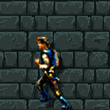
    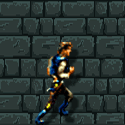
    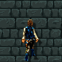
    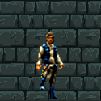
</p>

> P.S: please pay perticular attention to the down animation: apart from ordinary movements, Luke has performed a squat dogding posture after that. In addition, if you keep this posture for a longer time, he will pose a smugshrug posture mocking that the player still haven't found the light saber.

Various appearance via four different orientations **after picking the light saber**:

<p align="center">
    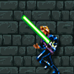
    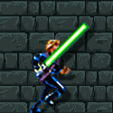
    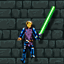
    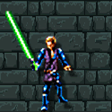
</p>

> P.S: mind that the squating and dodging action has been maintained for the appearance of the down action.

Lastly, the luke **killing attempt** (P.S: Luke needs to stand left next unit cell to Darth Vadar in order to kill him):

<p align="center">
    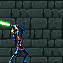
</p>

#### Darth Vadar

Darth Vadar remains not moved and keep shining during the game:

<p align="center">
    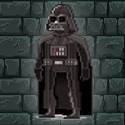
</p>
